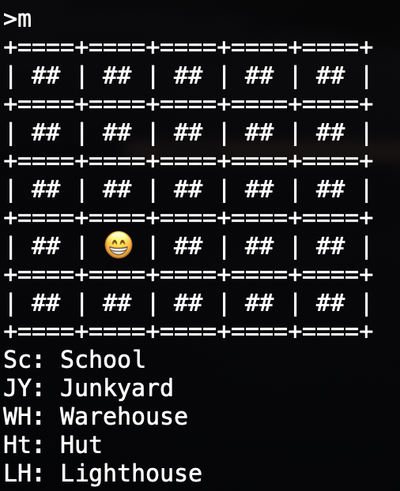

# forest monster

This is a text-based game developed in Java. 
This little project demonstrates the concepts of object oriented programming and how the objects interact wiith each other through function calls.

## Descriptions of the game:
Welcome to my little game. You are randomly placed in a space of a 5X5 forest. The mighty monster is also randomly placed in the forest, but the meighty monster won't be in the same spot as yours. You will be able to view your location in the forest, but the location of the mighty monster and houses are hidden from you until you find the map. The map is locked in a box in the lighthouse, which you have to wonder around the forest to find. You will need a key to unlock the box and get the map, which is also somewhere in the forest. During the game, you will enter some houses and find some food. There are 5 places where you can find foods: School, Junkyard, Warehouse, Hut, and Lighthouse. The rest of the spaces are just forest. If you accidently bump into the mighty monster during the game, the battle starts automatically. There is no escaping from the enemy. You don't need the map to win this game. However, your initial health is not enough to defeat the mighty monster, so eat alot of food and gain enough of health before the battle begins! This game involves some luck and more lucks to play. Have fun!

## Screenshots

### Commands:

### Item Descriptions:

### Without map:

### With map:

### Info:

## How to run the game?
clone this repository and run `java Main` in terminal